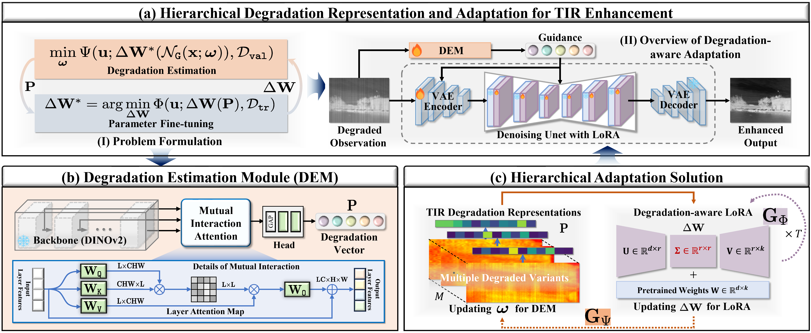

<div align="center">
<h2> HiDRA: Hierarchical Degradation Representation and Adaptation with Generative Priors for Enhancing Infrared Vision</h2>
Zihang Chen, Zhu Liu, Changbo Yan, Jinyuan Liu, Risheng Liu

School of Software Technology, Dalian University of Technology

If HiDRA is helpful for you, please help star this repo. Thanks!
</div>

### Framework Overview



---
### Updates

[2026-5-24] The paper is [here](https://openaccess.thecvf.com/content/CVPR2026/papers/Chen_HiDRA_Hierarchical_Degradation_Representation_and_Adaptation_with_Generative_Priors_for_CVPR_2026_paper.pdf).

[2026-3-20] Our paper has been accepted by CVPR 2026, the inference and code is available.

---

### Preparation

For preparation, first, you should create a new environment:

```
conda create -n hidra python=3.10
conda activate hidra
pip install -r requirements.txt
```

Then download the base model [SD-turbo](https://huggingface.co/stabilityai/sd-turbo), the pretrained [weights](https://drive.google.com/drive/folders/12rkVbM3el62cArIVyRdhwRBiN4857TXt?usp=drive_link) and the dataset [HM-TIR](https://github.com/Zihang-Chen/HM-TIR) for training and testing, then put them in the proper place.

### Training
Run the shell:
```
sh train.sh
```
Note that the full training process is GPU-memory intensive (~80GB). Please set an appropriate batch size and image resolution for the upper-level update stage based on your available GPU memory to ensure successful training.


### Inference and Testing

#### Synthetic TIR Image Enhancement

We provide testing data for evaluating HiDRA in paper. You can download them in [here](https://drive.google.com/drive/folders/1F8f5aG_jZV5L5srOo4G2yeoTqRuTfVBQ?usp=sharing).

Before testing, please modify the input and output paths in `test.sh`. Then run:

```bash
sh test.sh
```

To evaluate the enhanced TIR images, run the following command:
```
python src/evaluate_img.py --subfolders FPNC BSR --dataset your/enhanced/TIR/images --label_dir label/TIR/images --metrics lpips dists fid niqe maniqa
```

#### Real-World TIR Image Enhancement

For real-world TIR image enhancement, we follow the [DEAL](https://github.com/LiuZhu-CV/DEAL) pipeline, which evaluates TIR image quality using an image fusion model.

Specifically, we first process the real-world TIR images and then use [ReCoNet](https://github.com/dlut-dimt/reconet) to fuse each TIR-Visible image pair. Finally, we evaluate the fusion results using the metrics provided in [Metrics](https://github.com/RollingPlain/IVIF_ZOO/tree/main/Metric).

The TNO and RoadScene datasets are available [here](https://drive.google.com/drive/folders/1H-oO7bgRuVFYDcMGvxstT1nmy0WF_Y_6?usp=sharing). For MSRS, we selected several low-contrast scenes, which are provided [here](https://drive.google.com/drive/folders/1ydlzoVsDH_bBoG4987FxJtnjZZoOE1jE?usp=sharing).

### Citation

If this work has been helpful to you, please feel free to cite our paper!

```
@InProceedings{chen2026hidra,
    author    = {Chen, Zihang and Liu, Zhu and Yan, Changbo and Liu, Jinyuan and Liu, Risheng},
    title     = {HiDRA: Hierarchical Degradation Representation and Adaptation with Generative Priors for Enhancing Infrared Vision},
    booktitle = {Proceedings of the IEEE/CVF Conference on Computer Vision and Pattern Recognition (CVPR)},
    month     = {June},
    year      = {2026},
    pages     = {37434-37444}
}
```

### Any Question

If you have any other questions about the code or paper, please email to [Zihang Chen](mailto:chenzi_hang@mail.dlut.edu.cn) or [Zhu Liu](mailto:liuzhu@mail.dlut.edu.cn).


## Acknowledgement
Our core codes are based on [S3Diff](https://github.com/ArcticHare105/S3Diff), thanks for their contributions.


